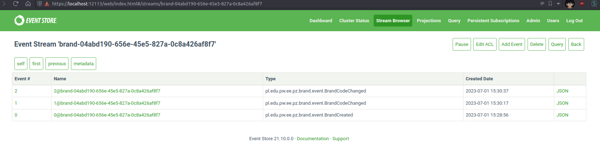
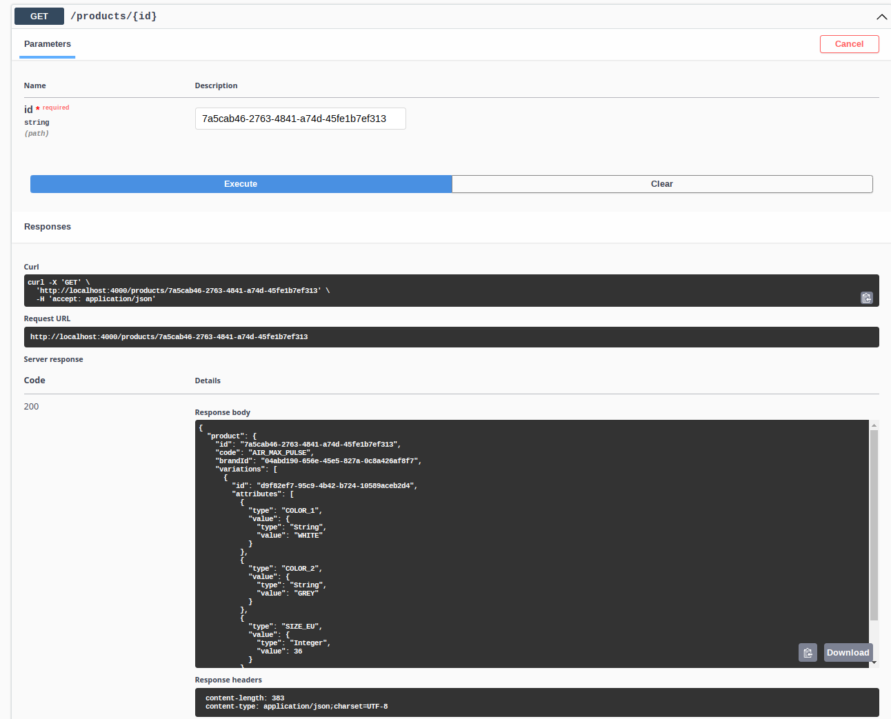
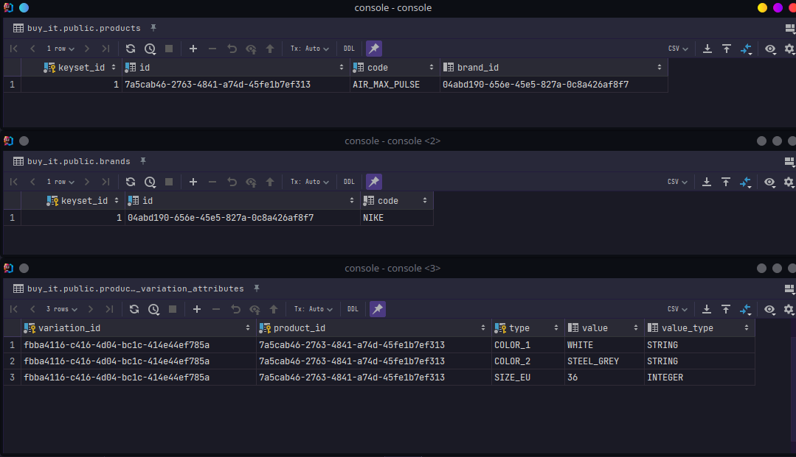

= Buy it
Oskar Natorski <oskar.natorski.stud@pw.edu.pl>; Tomasz Paździurek <tomasz.pazdziurek.stud@pw.edu.pl>
v0.0.1, 2023-07-01
:toc: left
:toclevels: 5
:sectnums:
:sectnumlevels: 5
:lang: pl
include::locale/attributes.adoc[]

Projekt realizowany w ramach przedmiotu Projekt Zespołowy prowdzony przez Ośrodek Kształcenia Na Odległość Politechniki Warszawskiej.
W ramach projektu zdecydowano się zrealizować uproszczoną implementację sklepu internetowego, sprzedającego obuwie.

[#architektura-projektu]
== Architektura projektu

Projekt został podzielony na 2. części - 2. aplikacje backendowe oraz 1. frontendowa.

Aplikacja "Buy It Web" to ogólnodostępna, publiczna aplikacja sklepu internetowego.
Klienci mogą za jej pomocą przeglądać i wyszukiwać produkty czy składać zamówienia.

Aplikacja "Buy It Web Admin" dostępna jest tylko dla zweryfikowanych pracowników sklepu, a połączenie sieciowe do aplikacji możliwe powinno być jedynie w ramach wydzielonej sieci link:https://en.wikipedia.org/wiki/Virtual_private_network[VPN].

Na rysunku poniżej przedstawiono diagram komponentów wykorzystywanych przez aplikację.

image::diagrams/c2.png[title="Komponenty aplikacji Buy It - Level 2 modelu C4"]

Powyższy diagram przygotowany został z wykorzystniem link:https://c4model.com/#ContainerDiagram[C4 model - level 2].

[#architektura-projektu_komponenty]
=== Komponenty

[#architektura-projektu_komponenty_frontend]
==== Frontend

Obie aplikacje frontendowe to aplikacje Webowe serwowana jako pliki statyczne za pośrednictwem serwera link:https://www.nginx.com[Nginx].

Aplikacje Webowe zostały napisana z wykorzystaniem:

1. Języka link:https://www.typescriptlang.org[TypeScript] (kompilowanego do link:https://en.wikipedia.org/wiki/JavaScript[JavaScript]).
2. Języka link:https://en.wikipedia.org/wiki/CSS[CSS] / link:https://sass-lang.com[Saas SCSS].
3. Języka link:https://en.wikipedia.org/wiki/HTML[HTML].
4. Frameworka link:https://react.dev[React].

Komunikacja między aplikacjami frontendowymi a aplikacją backendową została zrealizowana z wykorzystaniem HTTP z{nbsp}zastosowaniem REST (link:https://martinfowler.com/articles/richardsonMaturityModel.html#level2[Richardson Maturity Level 2]]).

[#architektura-projektu_komponenty_frontend_buy-it-web]
===== Buy It Web

Publicznie dostępna aplikacja internetowego sklepu z obuwiem, której odbiorcami są klienci sklepu.

Aplikacja udostępnia takie funkcje jak:

1. Utworzenie i logowanie do konta klienta.
2. Wyszukiwanie produktów wraz z informacją o ich dostępności i wariantów (np. różnych rozmiarów czy kolorów).
3. Zarządzanie koszykiem zakupowym - dodawanie / usuwanie produktów.
4. Złożenie o opłacenia zamówienia na podstawie koszyka zakupowego.
5. Przegląd historii zamówień.

[#architektura-projektu_komponenty_frontend_buy-it-web-admin]
===== Buy It Web Admin

Aplikacja typu "backoffice" dla pracowników sklepu.
Z założenia, niedostępna publicznie w sieci Internet.

Z aplikacji korzystać mogą pracownicy, posiadający różne role w aplikacji:

1. Administrator
2. Operator magazynu
3. Operator zamówień

[#architektura-projektu_komponenty_frontend_buy-it-web-admin_administrator]
====== Administrator

1. Wyszukiwanie i modyfikacja kont pracowniczyh. [Administrator]
2. Modyfikacja ról użytkowników.

[#architektura-projektu_komponenty_frontend_buy-it-web-admin_operator_magazynu]
====== Operator magazynu

1. Przeglądanie / wyszukiwanie produktów. [Operator magazynu]
2. Modyfikację produktów (dodawanie / usuwanie, edycja atrybutów - np. rozmiaru czy koloru). [Operator magazynu]

[#architektura-projektu_komponenty_frontend_buy-it-web-admin_operator_zamówień]
====== Operator zamówień

1. Przeglądanie / wyszukiwanie zamówień. [Operator zamówień]
2. Zmiana statusów zamówień (Złożone, Opłacone, W trakcie realizacji, Wysłane, Dostarczone). [Operator zamówień]

[#architektura-projektu_komponenty_backend]
==== Backend

Aplikacja backendowa to aplikacja serwerowa, która zarządza stanem magazynów, ofertą, zamówieniami itp.
Ta aplikacja jest głównym źródłem danych dla całego systemu i dba o zachowanie ich spójności.

W ramach aplikacji backendowej możemy wyróżnić takie komponenty jak:

1. <<architektura-projektu_komponenty_backend_buy-it-be>> - aplikacja serwerowa napisana w języku Java, która implementuje logikę biznesową systemu po stronie backendu.
Udostępnia 2. rodzaje API HTTP dla klientów aplikacji webowych - osobne dla aplikacji dla klientów sklepu <<architektura-projektu_komponenty_frontend_buy-it-web>> oraz osobne dla pracowników <<architektura-projektu_komponenty_frontend_buy-it-web-admin>>.
2. link:https://www.eventstore.com[EventStore DB] - baza danych noSQL, przechowująca strumień zdarzeń domenowych, wykonanych / zaaplikowanych przez agregaty domenowe w architekturze link:https://martinfowler.com/eaaDev/EventSourcing.html[Event Sourcing].
3. link:https://www.postgresql.org[PostgreSQL] - relacyjna baza danych, przechowująca dane do podglądu.
Wygenerowane z użyciem projekcji na podstawie zdarzeń domenowych.
4. link:https://min.io[MinIO] - baza obiektowa, przechowująca zdjęcia produktów czy logo marek.
Posiada API kompatybilne z link:https://aws.amazon.com/s3/[AWS S3].
5. link:https://redpanda.com[Redpanda] - broker zdarzeń, baza strumieniowa, służąca jako medium wymiany zdarzeń pomiędzy komponentami logiki biznesowej (np. agregatami domenowymi i projekcjami).
Posiada API kompatybilne z link:https://kafka.apache.org[Apache Kafka].

[#architektura-projektu_komponenty_backend_buy-it-be]
==== Buy It BE

Jest to główny komponent backendowy systemu.
W tym komponencie zaimplementowana została logika biznesowa części backendowej sklepu.

Aplikacja została napisana z wykorzystaniem architektury link:https://martinfowler.com/eaaDev/EventSourcing.html[Event Sourcing] oraz elementami architektur link:https://martinfowler.com/bliki/CQRS.html[CQRS] i link:https://en.wikipedia.org/wiki/Hexagonal_architecture_(software)[Heksagonalnej].

Wykorzystane języki i frameworki do utworzenia aplikacji to:

1. link:https://openjdk.org/projects/jdk/17/[Java 17].
2. link:https://en.wikipedia.org/wiki/SQL[SQL].
3. link:https://quarkus.io[Quarkus].
4. link:https://smallrye.io/smallrye-mutiny/2.3.1/[SmallRye Mutiny].

[#aktualny-stan-projektu]
== Aktualny stan projektu

[#aktualny-stan-projektu_buy-it-be]
=== Buy It BE

W ramach części backendowej projektu, aktualnie zrealizowano:

1. Architekturę aplikacji backendowej.
- Przygotowanie abstrakcji link:https://martinfowler.com/eaaDev/EventSourcing.html[Event Sourcing] oraz link:https://martinfowler.com/bliki/CQRS.html[CQRS] - dla agregatów i zdarzeń domenowych, publikacji zdarzeń, projekcji, obsługi komend i zapytań.
- Przygotowanie abstrakcji dla zapytań z wykorzystaniem link:https://vladmihalcea.com/sql-seek-keyset-pagination/[Keyset Pagination]
- Podział aplikacji link:https://quarkus.io[Quarkus] na moduły link:https://maven.apache.org[Maven], starając się odwzorować architekturę link:https://en.wikipedia.org/wiki/Hexagonal_architecture_(software)[Heksagonalną].
- Konfiguracja testów integracyjnych link:https://quarkus.io[Quarkus] z wykorzystaniem link:https://testcontainers.com[Testcontainers].
2. Integrację z bazą link:https://www.eventstore.com[EventStore DB].
3. Integrację z bazą link:https://www.postgresql.org[PostgreSQL] wraz z wykorzystaniem narzędzia migracji bazy danych [Liquibase].
4. Integrację z brokerem komunikatów / zdarzeń link:https://redpanda.com[Redpanda].
5. Integrację z bazą link:https://min.io[MinIO].
6. Konfigurację środowiska lokalnego z wykorzystaniem link:https://www.docker.com[Docker] i link:https://docs.docker.com/compose/[docker compose].
7. Implementacja pierwszych usług do zarządzania produktem.
- Proste wyszukiwanie produktu po podstawowych atrybutach (id produktu, kod produktu, id marki)
- Tworzenie nowego produktu wraz z jego wariacjami / zestawami atrybutów
- Aktualizacja produktu wraz z jego wariacjami / zestawami atrybutów
- Aktualizacja liczby wariacji produktów w magazynie
- Tworzenie i modyfikacja marek.
8. Przygotowanie dokumentacji link:https://www.openapis.org[OpenAPI] dla wystawionych usług HTTP wraz z wykorzystaniem link:https://quarkus.io/guides/openapi-swaggerui[Quarkus Swagger UI].

[#aktualny-stan-projektu_buy-it-be_uruchomienie-lokalnie]
==== Uruchomienie lokalnie

Część backendową można uruchomić na lokalnym środowisku.
Wymagane jest posiadanie na maszynie link:https://www.docker.com[Docker] wraz z link:https://docs.docker.com/compose/[docker compose] oraz link:https://openjdk.org/projects/jdk/17/[Java 17].

W celu ułatwienia uruchomienia, przygotowano plik link:../Makefile[Makefile] z przygotowanymi "celami":

1. `local-infra-up` - uruchamia infrastrukturę potrzebną do działania aplikacji (link:https://www.eventstore.com[EventStore DB], link:https://www.postgresql.org[PostgreSQL], link:https://min.io[MinIO], link:https://redpanda.com[Redpanda]) z wykorzystaniem link:https://docs.docker.com/compose/[docker compose].
2. `run-local` - uruchamia aplikację Quarkus na lokalnej maszynie.

[source,shell]
----
$: make local-infra-up
docker compose -f local/docker-compose.yml up -d
[+] Building 0.0s (0/0)
[+] Running 9/9
 ✔ Container buy-it-eventstoredb-certs  Started  0.4s
 ✔ Container buy-it-postgres-adminer    Running  0.0s
 ✔ Container buy-it-postgres            Running  0.0s
 ✔ Container buy-it-minio               Running  0.0s
 ✔ Container buy-it-redpanda            Running  0.0s
 ✔ Container buy-it.eventstore.node3    Running  0.0s
 ✔ Container buy-it.eventstore.node2    Running  0.0s
 ✔ Container buy-it-redpanda-console    Running  0.0s
 ✔ Container buy-it.eventstore.node1    Running  0.0s

$: make run-local
./mvnw compile quarkus:dev -pl application -Dquarkus.profile=local --also-make
# ...
# logi z uruchomienia aplikacji Quarkus
# ...
2023-07-01 15:08:21,097 INFO  [io.quarkus] (Quarkus Main Thread) application 0.0.0-227e5a29 on JVM (powered by Quarkus 3.1.0.Final) started in 7.773s. Listening on: http://localhost:4000
2023-07-01 15:08:21,098 INFO  [io.quarkus] (Quarkus Main Thread) Profile local activated. Live Coding activated.
2023-07-01 15:08:21,099 INFO  [io.quarkus] (Quarkus Main Thread) Installed features: [agroal, cdi, config-yaml, hibernate-validator, jdbc-postgresql, kafka-client, liquibase, narayana-jta, reactive-pg-client, resteasy-reactive, resteasy-reactive-jackson, smallrye-context-propagation, smallrye-graphql, smallrye-openapi, smallrye-reactive-messaging, smallrye-reactive-messaging-kafka, swagger-ui, vertx]

--
Tests paused
Press [r] to resume testing, [o] Toggle test output, [:] for the terminal, [h] for more options>
----

Po uruchomieniu aplikacji w ten sposób, dostępny jest panel developerski Quarkus pod adresem link:http://localhost:4000/q/dev-ui/extensions[].

[#aktualny-stan-projektu_buy-it-be_testy-api]
==== Testy API

W ramach aktualnego stanu projektu, wykonano proste manualne testy API z wykorzystaniem Swagger UI.

[#aktualny-stan-projektu_buy-it-be_testy-api_utworzenie-marki]
===== Utworzenie marki

image::images/create-brand-request.png[title="Utworzenie marki - Swagger UI"]

Wykonane żądanie odpowiada wywołaniu cURL:

[source,shell]
----
curl -X 'POST' \
  'http://localhost:4000/brands' \
  -H 'accept: application/json' \
  -H 'Content-Type: multipart/form-data' \
  -F 'logoImage={}' \
  -F 'code=ADIDAS'
----

Otrzymano odpowiedź o statusie 201 CREATED i ID utworzonej marki w treści:

[source,json]
----
{
  "id": "04abd190-656e-45e5-827a-0c8a426af8f7"
}
----

W konsoli MinIO widzimy zapisane logo dla marki o tym samym ID:

image::images/minio-brand-logo.png[title="Logo marki - MinIO"]

Logo ma 2 bajty, ponieważ w testach jako logo przestany został "string" `{}`.

[#aktualny-stan-projektu_buy-it-be_testy-api_modyfikacja-kodu-marki]
===== Modyfikacja kodu marki

image::images/update-brand-code.png[title="Modyfikacja kodu marki - Swagger UI"]

Wykonane żądanie odpowiada wywołaniu cURL:

[source,shell]
----
curl -X 'PUT' \
  'http://localhost:4000/brands/04abd190-656e-45e5-827a-0c8a426af8f7/code' \
  -H 'accept: application/json' \
  -H 'Content-Type: application/json' \
  -d '{
  "code": "NIKE"
}'
----

Otrzymano odpowiedź o statusie 204 NO_CONTENT.

W konsoli EventStoreDB (link:https://localhost:12113/[]) możemy zaobserwoać zdarzenia domenowe zarejestrowane dla marki:

[#aktualny-stan-projektu_buy-it-be_testy-api_utworzenie-produktu]
===== Utworzenie produktu

image::images/create-product.png[title="Utworzenie produktu - Swagger UI"]

Wykonane żądanie odpowiada wywołaniu cURL:

[source,shell]
----
curl -X 'POST' \
  'http://localhost:4000/products' \
  -H 'accept: application/json' \
  -H 'Content-Type: application/json' \
  -d '{
  "code": "AIR_MAX_PULSE",
  "brandId": "04abd190-656e-45e5-827a-0c8a426af8f7",
  "variations": [
    {
      "id": "42009870-2248-4f82-84cb-7965c4a2b2ff",
      "attributes": [
        {
          "type": "SIZE_EU",
          "value": {
            "type": "Integer",
            "value": 36
          }
        },
        {
          "type": "COLOR_1",
          "value": {
            "type": "String",
            "value": "WHITE"
          }
        },
        {
          "type": "COLOR_2",
          "value": {
            "type": "String",
            "value": "GREY"
          }
        }
      ]
    }
  ]
}'
----

Otrzymano odpowiedź o statusie 201 CREATED wraz z ID produktu w treści:

[source,json]
----
{
  "id": "7a5cab46-2763-4841-a74d-45fe1b7ef313"
}
----

[#aktualny-stan-projektu_buy-it-be_testy-api_modyfikacja-produktu]
===== Modyfikacja produktu

image::images/create-product.png[title="Utworzenie produktu - Swagger UI"]

Wykonane żądanie odpowiada wywołaniu cURL (zmiana "COLOR_2" na "STEEL_GRAY"):

[source,shell]
----
curl -X 'PUT' \
  'http://localhost:4000/products/7a5cab46-2763-4841-a74d-45fe1b7ef313' \
  -H 'accept: */*' \
  -H 'Content-Type: application/json' \
  -d '{
    "code": "AIR_MAX_PULSE",
    "brandId": "04abd190-656e-45e5-827a-0c8a426af8f7",
    "variations": [
      {
        "id": "d9f82ef7-95c9-4b42-b724-10589aceb2d4",
        "attributes": [
          {
            "type": "COLOR_1",
            "value": {
              "type": "String",
              "value": "WHITE"
            }
          },
          {
            "type": "COLOR_2",
            "value": {
              "type": "String",
              "value": "STEEL_GREY"
            }
          },
          {
            "type": "SIZE_EU",
            "value": {
              "type": "Integer",
              "value": 36
            }
          }
        ]
      }
    ]
  }'
----

Otrzymano odpowiedź o statusie 204 NO_CONTENT.

W konsoli EventStoreDB (link:https://localhost:12113/[]) możemy zaobserwoać zdarzenia domenowe zarejestrowane dla produktu:

image::images/create-and-update-product-events.png[title="Zdarzenia dla produktu - EventStoreDB"]

[#aktualny-stan-projektu_buy-it-be_testy-api_wyszukanie-produktu-po-id]
===== Wyszukanie produktu po ID

Wykonane żądanie odpowiada wywołaniu cURL:

[source,shell]
----
curl -X 'GET' \
  'http://localhost:4000/products/7a5cab46-2763-4841-a74d-45fe1b7ef313' \
  -H 'accept: application/json'
----

Otrzymano odpowiedź o statusie 200 OK wraz z danymi znalezionego produktu:

[source,json]
----
{
  "product": {
    "id": "7a5cab46-2763-4841-a74d-45fe1b7ef313",
    "code": "AIR_MAX_PULSE",
    "brandId": "04abd190-656e-45e5-827a-0c8a426af8f7",
    "variations": [
      {
        "id": "d9f82ef7-95c9-4b42-b724-10589aceb2d4",
        "attributes": [
          {
            "type": "COLOR_1",
            "value": {
              "type": "String",
              "value": "WHITE"
            }
          },
          {
            "type": "COLOR_2",
            "value": {
              "type": "String",
              "value": "GREY"
            }
          },
          {
            "type": "SIZE_EU",
            "value": {
              "type": "Integer",
              "value": 36
            }
          }
        ]
      }
    ]
  }
}
----

[#aktualny-stan-projektu_buy-it-be_testy-api_wyszukanie-produktu-po-kodzie]
===== Wyszukanie produktu po kodzie

image::images/get-product-by-basic-details.png[title="Wyszukanie produktu po kodzie - Swagger UI"]

Wykonane żądanie odpowiada wywołaniu cURL:

[source,shell]
----

curl -X 'GET' \ 'http://localhost:4000/products?code=AIR_MAX' \ -H 'accept: application/json'

----

Otrzymano odpowiedź o statusie 200 OK wraz z danymi znalezionego produktu i informacją dot. paginacji:

[source,json]
----
{
    "products": {
        "type": "Single",
        "value": {
            "id": "7a5cab46-2763-4841-a74d-45fe1b7ef313",
            "code": "AIR_MAX_PULSE",
            "brandId": "04abd190-656e-45e5-827a-0c8a426af8f7",
            "variations": [
                {
                    "id": "fbba4116-c416-4d04-bc1c-414e44ef785a",
                    "attributes": [
                        {
                            "type": "COLOR_1",
                            "value": {
                                "type": "String",
                                "value": "WHITE"
                            }
                        },
                        {
                            "type": "COLOR_2",
                            "value": {
                                "type": "String",
                                "value": "STEEL_GREY"
                            }
                        },
                        {
                            "type": "SIZE_EU",
                            "value": {
                                "type": "Integer",
                                "value": 36
                            }
                        }
                    ]
                }
            ]
        },
        "pageCount": 1,
        "page": {
            "size": 1,
            "prevKeySetId": 0,
            "nextKeySetId": 0
        },
        "itemsCount": 1
    }
}
----

[#aktualny-stan-projektu_buy-it-be_testy-api_stan-aplikacji-po-testach]
===== Stan aplikacji po testach

Po wykonanych w/w testach, możemy zweryfikować stan danych w bazie danych PostgreSQL oraz przesłane zdarzenia w Redpanda.

[#aktualny-stan-projektu_buy-it-be_testy-api_stan-aplikacji-po-testach_postgresql]
====== PostgreSQL

Na powyższym rysunku możemy zaobserwować, utworzony produkt, markę oraz aktualne atrybuty produktu.

[#aktualny-stan-projektu_buy-it-be_testy-api_stan-aplikacji-po-testach_redpanda]
====== Redpanda

Korzystając z konsoli Webowej Redpanda (link:http://localhost:18080/topics/domain-events[]]), możemy podejrzeć przesłane zdarzenia w ramach naszych testów:

image::images/redpanda-events.png[title="Zdarzenia po testach - Redpanda"]
